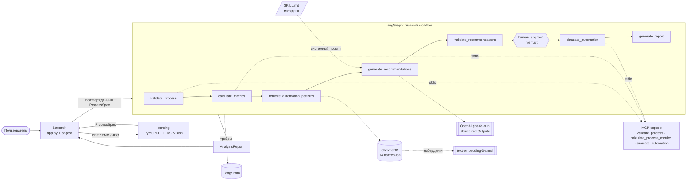

# ARCHITECTURE — ProcessMind AI

Документ описывает то, что реализовано в коде. Что проверено на практике, а что нет, — в [AUDIT.md](AUDIT.md).

## 1. Общая схема

Пунктир — вызов внешнего по отношению к графу компонента. Ошибочные исходы (`invalid`, `failed`, `no_recommendations`, `no_selection`) из любого узла ведут напрямую в `generate_report`.

## 2. Компоненты

| Компонент | Каталог | Назначение |
|---|---|---|
| Streamlit-интерфейс | `app.py`, `pages/`, `processmind/ui/` | 4 страницы: распознавание процесса, AI-анализ, база знаний, о проекте. Единый стиль без внешних frontend-библиотек |
| Извлечение процесса | `processmind/parsing/` | PDF: текст PyMuPDF → LLM со Structured Outputs. PNG/JPG: Vision той же моделью. Затем строгая валидация Pydantic (`ProcessSpec`) |
| Модели данных | `processmind/models.py` | `ProcessSpec`, `ProcessStep` (неизвестные значения — `None`), отчёты и метрики |
| Workflow | `processmind/workflow/graph.py` | Главный граф LangGraph: 8 узлов, условные переходы, human-in-the-loop |
| Анализ | `processmind/analysis/` | загрузка Skill; сборка запроса; рекомендации; **программная валидация** рекомендаций; поиск паттернов для процесса; `AnalysisReport` и Markdown-отчёт |
| Skill | `.claude/skills/process-analysis/SKILL.md` | Методика анализа: правила выявления ручных операций, выбор паттернов, требования к обоснованию, запрет выдумывания фактов, правила модельных оценок |
| RAG | `processmind/rag/` | 14 паттернов в Markdown → chunking по разделам → эмбеддинги → ChromaDB → Top-3 |
| MCP | `processmind/mcp/` | Сервер (отдельный процесс) и клиент (stdio) |
| Визуализация | `processmind/visualization/` | Graphviz: схемы AS-IS и TO-BE; рендер выполняет браузер (не требует установки бинарного Graphviz) |
| Наблюдаемость | `processmind/observability.py` | Конфигурация LangSmith, декораторы трассировки; всё выключено, пока не заданы переменные |
| Оценки | `evals/` | Golden Dataset (30), метрики, A/B, эксперимент с temperature, генератор `EVALS.md` |

## 3. Последовательность обработки

1. **Загрузка.** Формат определяется по расширению файла; неподдерживаемый формат, пустой файл и PDF без текстового слоя — понятные ошибки до вызова LLM.
2. **Извлечение.** Результат — `ProcessSpec`: операции, участники, длительности, тип выполнения, связи. Что не сказано в документе — остаётся пустым. Список предупреждений (например, ветвления на изображении) показывается пользователю.
3. **Подтверждение №1 (пользователь).** Таблица операций редактируется; схема AS-IS перерисовывается. Дальше идёт только подтверждённый процесс.
4. **Запуск графа** (`start_analysis`) в потоке с `thread_id`. Узлы 1–5 выполняются подряд и останавливаются на `human_approval`.
5. **Подтверждение №2 (пользователь, `interrupt`).** Пользователь выбирает рекомендации и задаёт допущения о длительности после автоматизации. Граф возобновляется (`resume_analysis`, `Command(resume=…)`).
6. **Симуляция и отчёт.** MCP считает TO-BE, `generate_report` собирает `AnalysisReport`; интерфейс строит сравнение, схемы и Markdown.

## 4. LangGraph

| Узел | Что делает | Внешний вызов |
|---|---|---|
| `validate_process` | проверка процесса; не словарь / неверная структура → исход `invalid` | MCP `validate_process` |
| `calculate_metrics` | время, ручная доля, известные и неизвестные значения | MCP `calculate_process_metrics` |
| `retrieve_automation_patterns` | Top-3 на процесс и на каждую ручную операцию → пул паттернов | RAG, эмбеддинги |
| `generate_recommendations` | LLM со Skill как системным промптом | OpenAI |
| `validate_recommendations` | отбрасывает недопустимое (см. §7) | — |
| `human_approval` | `interrupt()` с рекомендациями; проверяет решение пользователя | — |
| `simulate_automation` | модельная оценка TO-BE и метрики TO-BE | MCP `simulate_automation`, `calculate_process_metrics` |
| `generate_report` | итоговый `AnalysisReport` для любого исхода | — |

- **Условные переходы:** после узлов 1–5 функция `stop_on_failure` направляет граф в `generate_report`, если исход — `invalid`, `failed`, `no_recommendations` или `no_selection`. Поэтому «нет подходящих паттернов», «пользователь ничего не выбрал» и «сервис недоступен» — штатные исходы, а не исключения.
- **Human-in-the-loop:** пауза реализована через `interrupt()` и `MemorySaver`; факт паузы определяется по `state.tasks[].interrupts` (после повторного `interrupt()` в узле `state.next` пуст). Некорректное решение пользователя (например, неизвестный `rec_id`, повторный выбор или не указанная длительность) не роняет граф: узел повторно выдаёт `interrupt` с текстом ошибки.
- **Узел `human_approval` выполняется заново при возобновлении** — поэтому до `interrupt()` в нём нет побочных эффектов.

## 5. MCP

`processmind/mcp/server.py` — сервер на MCP Python SDK (`MCPServer`), запускается отдельным процессом; клиент (`client.py`) подключается по stdio через `ClientSession` + `stdio_client` и используется узлами графа.

| Инструмент | Назначение |
|---|---|
| `validate_process` | структурная и логическая проверка процесса (уникальность ID, ссылки на следующие операции, некорректные длительности) |
| `calculate_process_metrics` | суммарное время, число операций, доля ручных, известные/неизвестные значения; значения «в месяц» — только если задано число запусков |
| `simulate_automation` | пересчёт процесса при допущениях пользователя о длительности; результат помечен как модельная оценка |

Дополнительно сервер отдаёт `search_knowledge_base` и `get_process_spec_schema` (не входят в основной граф).

Расчёты — обычный Python, без LLM и без «типового процента сокращения»: если пользователь не задал длительность после автоматизации, оценка для операции не строится.

## 6. RAG

- **Источник:** `knowledge_base/automation_patterns/AP-001…AP-014` — синтетические паттерны в Markdown: проблема, условия применимости, подход, ожидаемый эффект, ограничения.
- **Chunking** по смысловым разделам; метаданные `pattern_id`, `title`, `source`, `section`, `chunk_id`.
- **Индекс:** `text-embedding-3-small`, ChromaDB (cosine, `embedding_function=None` — эмбеддинги считаются явно, чтобы учитывать токены и трассировать вызовы); id чанков детерминированы, дубли исключены; повторное построение пересчитывает только изменённое.
- **Поиск:** Top-3 по косинусной близости. Ключевые слова не используются.
- **Использование:** запрос строится для процесса и для каждой ручной операции; в промпт попадают найденные паттерны (`knowledge_base_patterns`). Если база недоступна — предупреждение, рекомендации без ссылок на паттерны.

## 7. Принцип «LLM предлагает, код проверяет»

LLM возвращает рекомендации в строгой схеме; код затем:

- подставляет факты об операции сам (`process_facts`: название, участник, исходная длительность) — LLM их не переписывает;
- отбрасывает рекомендации с несуществующими ID операций, ссылками на паттерны, которых не было в найденных, для уже автоматизированных операций и с неуказанным типом выполнения без явных признаков ручной работы;
- отбрасывает количественные утверждения об эффекте, не подкреплённые расчётом;
- требует условия применимости паттерна;
- никогда не принимает длительность «после автоматизации» от LLM за факт: это допущение, которое подтверждает пользователь.

Skill читается с диска при каждом запуске, а sha256 применённой версии попадает в отчёт.

## 8. Наблюдаемость

`@traceable`/`trace` вокруг запуска графа и узлов, `wrap_openai` для LLM (токены, модель, параметры), retriever-runs для RAG, tool-runs для MCP, embedding-runs для эмбеддингов. Включается `LANGSMITH_TRACING=true` и ключом; без них — никаких сетевых вызовов к LangSmith. Инструментация проверена тестами на локальном двойнике API; реальное облако не проверялось ([AUDIT.md](AUDIT.md)).

## 9. Обоснование технологий

| Выбор | Почему |
|---|---|
| **LangGraph** | нужны условные переходы, сохраняемое состояние и нативный `interrupt()` для паузы на решении пользователя; один граф вместо многоагентной схемы — задача линейная, агентов для неё не требуется |
| **MCP (stdio)** | расчёты изолированы от LLM и приложения, инструменты вызываются по стандартному протоколу; детерминированность и тестируемость |
| **ChromaDB** | локальная встраиваемая векторная БД: без отдельного сервера, простое хранение метаданных |
| **text-embedding-3-small** | достаточное качество на коротких русскоязычных текстах (Hit@3 83% на Golden Dataset) при низкой цене |
| **gpt-4o-mini** | задан условием проекта; поддерживает Structured Outputs и Vision. Сравнения с другими моделями не проводились; стоимость, латентность и компромиссы — в [MODEL_CHOICE.md](MODEL_CHOICE.md) |
| **Structured Outputs + Pydantic** | ответ LLM — типизированный объект, а не текст, который приходится разбирать |
| **Streamlit** | быстрый интерфейс без frontend-разработки |
| **Graphviz** | автоматическая раскладка схем AS-IS/TO-BE, HTML-метки для выделения изменений |
| **PyMuPDF** | извлечение текстового слоя без внешних утилит |
| **LangSmith** | трассировка узлов, LLM, RAG и MCP в одном месте |

## 10. Архитектурные компромиссы

- **Один граф вместо агентов.** Проще отлаживать и тестировать, поведение предсказуемо; ценой отсутствия самостоятельного планирования.
- **`MemorySaver`.** Состояние паузы хранится в памяти процесса: просто и достаточно для демонстрации, но приостановленный анализ теряется при перезапуске. Для продакшена нужен персистентный checkpointer.
- **Пул паттернов из нескольких запросов.** Повышает полноту (Hit по пулу 87% против 83% для одного запроса), но увеличивает промпт (в среднем +2007 токенов на пример) и задержку (+2.97 с).
- **RAG не улучшил F1.** На Golden Dataset разница macro-F1 в пределах шума (два независимых прогона дали разные знаки разницы: −0.014 (06:50 UTC) и +0.029 (10:45 UTC), оба ниже порога шума 0.05); выигрыш RAG — прослеживаемость (ссылка на паттерн и условия применимости у 100% рекомендаций), а не точность. На 4 отрицательных примерах с RAG хуже в обоих прогонах (1/4 против 3/4 и 4/4) — выборка мала, причинность не доказана.
- **temperature = 0.0.** На 6 примерах × 3 повтора большая температура не дала прироста F1 (−0.022) и хуже по устойчивости (0.667 против 0.741) — выбор определён правилом, заданным до эксперимента. Важная оговорка: в предыдущем прогоне тот же эксперимент показал обратный знак (+0.122), то есть на такой выборке эффект температуры неотличим от шума (см. [EVALS.md](EVALS.md)).
- **Vision — вероятностный.** Связи и типы операций на изображениях могут читаться неверно; система предупреждает и оставляет правку пользователю, но не гарантирует распознавание.
- **Локальные схемы.** Рендер Graphviz — в браузере (Streamlit), поэтому нет зависимости от бинарного Graphviz, но экспорт схем в файл не реализован.
