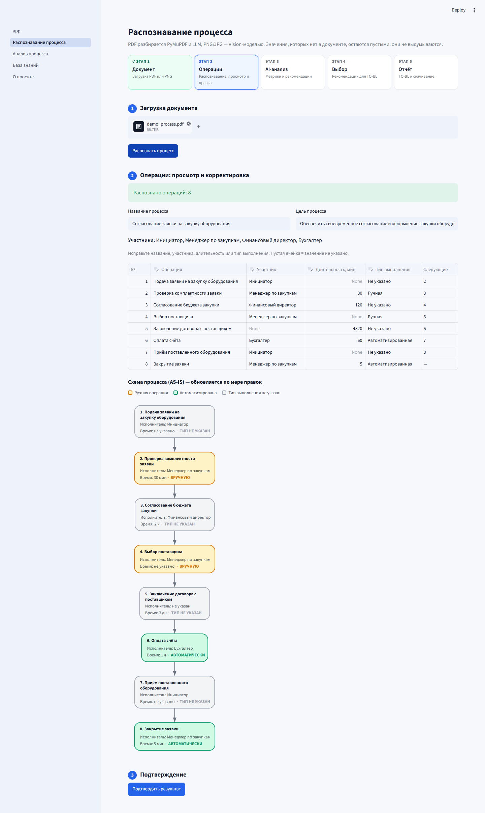
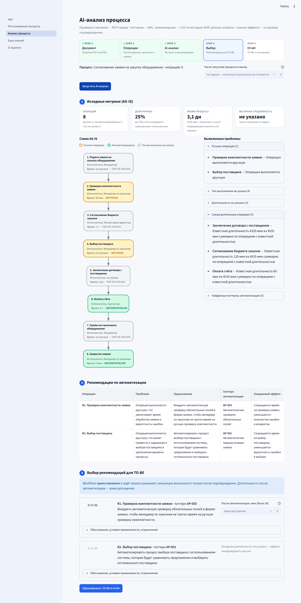
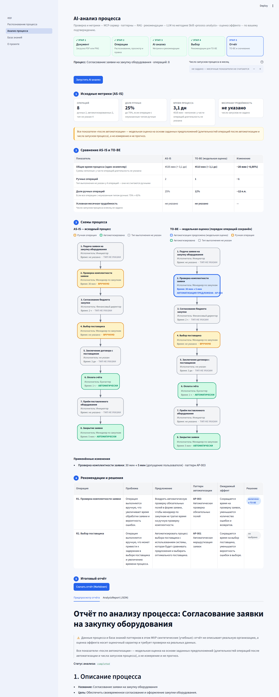
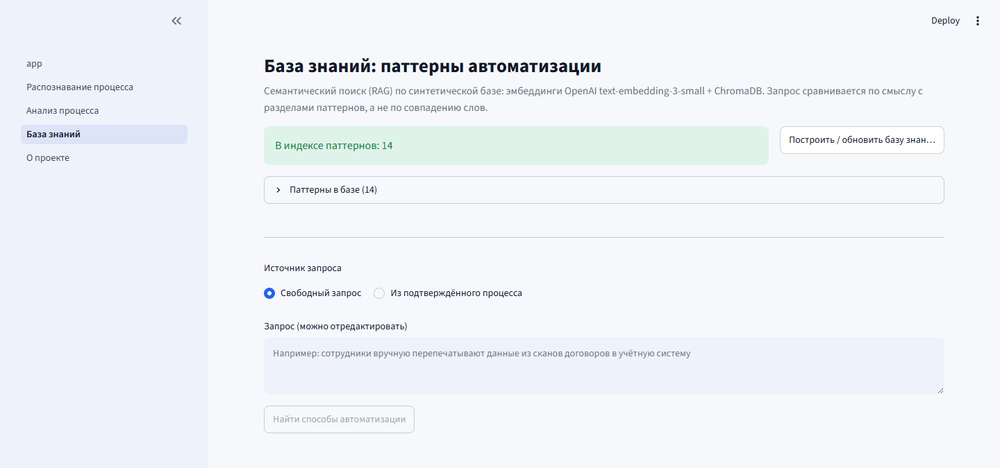

# ProcessMind AI

Интеллектуальный анализ и автоматизация бизнес-процессов. Финальный проект курса по LLM Engineering.

Загрузите PDF или PNG с описанием бизнес-процесса — получите структурированную модель процесса, схему AS-IS, метрики, обоснованные
рекомендации по автоматизации из базы знаний паттернов и **модельную** оценку целевого процесса TO-BE с отчётом в Markdown.

> ⚠️ **Все данные в проекте синтетические** (демо-процессы, база знаний паттернов, Golden Dataset). Показатели «после автоматизации» —
> модельная оценка на основе допущений, которые задаёт пользователь, а не измерение и не прогноз. Реальные регламенты не используются.

## Какую проблему решает

Аналитик, у которого есть описание процесса (регламент в PDF или схема-картинка), вручную выписывает операции, считает время и трудоёмкость,
ищет, что можно автоматизировать, и прикидывает эффект. Это долго, неповторяемо и легко приводит к выдуманным допущениям.

ProcessMind AI делает то же самое в проверяемом виде:

- **не выдумывает данные**: неуказанные участники, длительности и типы выполнения остаются пустыми и явно помечаются;
- **разделяет ответственность**: LLM предлагает, код проверяет (ID операций, ссылки на паттерны, количественные утверждения), человек подтверждает;
- **считает детерминированно**: метрики и симуляцию выполняет отдельный MCP-сервер обычным Python-кодом, а не LLM;
- **показывает источники**: каждая рекомендация ссылается на паттерн и документ базы знаний.

## Возможности

| Этап | Что происходит | Компоненты |
|---|---|---|
| Документ → операции | PDF: текст PyMuPDF → LLM (Structured Outputs). PNG/JPG: GPT-4o-mini Vision. Результат — `ProcessSpec`, проверенный Pydantic | `processmind/parsing/` |
| Просмотр и правка | таблица операций, схема AS-IS обновляется по мере правок, подтверждение | `pages/1_Распознавание_процесса.py` |
| AI-анализ | граф LangGraph: валидация и метрики (MCP) → поиск паттернов (RAG) → рекомендации (LLM + Skill) → программная валидация | `processmind/workflow/` |
| Выбор пользователя | **пауза workflow** (human-in-the-loop): выбор рекомендаций и допущений о длительности | `human_approval` |
| TO-BE и отчёт | симуляция (MCP), схемы AS-IS/TO-BE, сравнение показателей, отчёт в Markdown | `processmind/analysis/report.py`, `visualization/` |

Подробная архитектура — в [ARCHITECTURE.md](ARCHITECTURE.md); выбор модели, стоимость и гиперпараметры — в [MODEL_CHOICE.md](MODEL_CHOICE.md).

## Скриншоты

Снимки сделаны в работающем приложении на демо-процессе `samples/demo_process.pdf` (реальные вызовы OpenAI, синтетические данные). Развёрнутого публичного демо нет — приложение запускается локально (см. «Запуск»).

| | |
|---|---|
| **1. Распознавание** — операции из PDF; пустые значения остаются пустыми; схема AS-IS обновляется по мере правок |  |
| **2. AI-анализ, workflow на паузе** — метрики, проблемы, паттерны из RAG, рекомендации; ожидание решения пользователя |  |
| **3. TO-BE и отчёт** — сравнение показателей («модельная оценка»), схемы AS-IS/TO-BE, решения, отчёт Markdown |  |
| **4. База знаний** — 14 паттернов в ChromaDB, семантический поиск |  |

## Установка

Требуется Python. **Проверено на Python 3.14.5** (Windows 11); `pyproject.toml` заявляет `>=3.11`, но версии 3.11–3.13 не проверялись.

```powershell
git clone https://github.com/Adilbek-S/processmind-ai.git
cd processmind-ai
python -m venv .venv
.venv\Scripts\Activate.ps1          # Linux/macOS: source .venv/bin/activate
pip install -r requirements.txt
copy .env.example .env               # Linux/macOS: cp .env.example .env
```

Проверка чистой установки: `pip install -r requirements.txt` в новом окружении и `pytest` выполнены успешно (см. [AUDIT.md](AUDIT.md)).

## Настройка переменных окружения

Все настройки читаются из `.env` (шаблон — `.env.example`). Секреты в репозиторий не попадают (`.env` в `.gitignore`).

| Переменная | Назначение | По умолчанию |
|---|---|---|
| `OPENAI_API_KEY` | **обязательна**: извлечение процесса, рекомендации, эмбеддинги | — |
| `OPENAI_MODEL` | LLM | `gpt-4o-mini` |
| `EMBEDDING_MODEL` | модель эмбеддингов | `text-embedding-3-small` |
| `LLM_TEMPERATURE`, `LLM_TOP_P`, `LLM_MAX_TOKENS` | параметры генерации (обоснование — [MODEL_CHOICE.md](MODEL_CHOICE.md) и [EVALS.md](EVALS.md)) | `0.0`, `1.0`, `4096` |
| `CHROMA_PERSIST_DIR` | каталог векторной базы ChromaDB | `./data/chroma` |
| `LANGSMITH_TRACING`, `LANGSMITH_API_KEY`, `LANGSMITH_PROJECT`, `LANGSMITH_ENDPOINT` | трассировка LangSmith (необязательно; прежние `LANGCHAIN_*` тоже работают) | выключена |

Без `OPENAI_API_KEY` приложение запускается, но распознавание, поиск и анализ завершаются понятной ошибкой: имитации ответов нет.

## Запуск

```powershell
streamlit run app.py
```

Приложение откроется на `http://localhost:8501`. **Перед первым анализом постройте базу знаний** (один раз; повторный запуск идемпотентен и ничего не пересчитывает, если документы не менялись):
страница «База знаний» → «Построить / обновить базу знаний», либо из консоли:

```powershell
python -c "from processmind.rag.knowledge_base import build_knowledge_base; print(build_knowledge_base())"
```

Если базу не построить, анализ всё равно выполнится, но рекомендации будут без ссылок на паттерны — приложение предупредит об этом.

## Демонстрационный сценарий

Демо-файлы лежат в `samples/` (пересоздаются командой `python -m scripts.demo_data`): `demo_process.pdf` (регламент) и `demo_process.png` (схема) — один и тот же синтетический процесс «Согласование заявки на закупку оборудования» из 8 операций. Часть операций намеренно без участника или длительности — так видно, что система ничего не выдумывает.

1. Страница **«Распознавание процесса»**: загрузите `samples/demo_process.pdf` → «Распознать процесс» → проверьте таблицу операций (можно править) → «Подтвердить результат».
2. Страница **«AI-анализ»**: при желании задайте число запусков в месяц → «Запустить AI-анализ». Появятся исходные метрики, схема AS-IS, выявленные проблемы, найденные паттерны и таблица рекомендаций; workflow **приостановлен**.
3. Отметьте рекомендацию, задайте допущение о длительности после автоматизации (если LLM его не предложила) → «Сформировать TO-BE и отчёт».
4. Смотрите сравнение AS-IS и TO-BE, схемы рядом, таблицу решений; скачайте отчёт (Markdown).
5. То же для PNG (`samples/demo_process.png`): работает Vision-модель.

Сценарий на 10 минут для защиты — в [DEMO.md](DEMO.md); презентация — [docs/ProcessMind_AI_presentation.pdf](docs/ProcessMind_AI_presentation.pdf) (13 слайдов; план — [PRESENTATION.md](PRESENTATION.md)).

Скрипты для проверки компонентов без интерфейса (реальные вызовы OpenAI):

```powershell
python -m scripts.verify_live       # извлечение из PDF и PNG против эталона
python -m scripts.verify_kb_live    # RAG: 14 сценариев, нужный паттерн должен быть в Top-3
python -m scripts.demo_mcp          # три MCP-инструмента через MCP-клиент (stdio)
python -m scripts.run_analysis --assume R1=5   # сквозной анализ демо-процесса (задан в коде) с паузой и подтверждением
```

## Мониторинг: LangSmith

Трассировка включается только переменными окружения; без них приложение работает как обычно, а трейсов нет.

1. Получите API-ключ: <https://smith.langchain.com> → Settings → API Keys.
2. Добавьте в `.env`:

   ```
   LANGSMITH_TRACING=true
   LANGSMITH_API_KEY=<ваш ключ>
   LANGSMITH_PROJECT=processmind-ai
   ```

   (для EU-региона — ещё `LANGSMITH_ENDPOINT=https://eu.api.smith.langchain.com`).
3. Перезапустите приложение и выполните анализ либо выполните проверку одной командой:

   ```powershell
   python -m evals.verify_tracing
   ```

   Она запускает реальный анализ демо-процесса, ждёт появления трейса в LangSmith и проверяет его состав. Если LangSmith не настроен,
   команда завершается ошибкой с инструкцией — успех не имитируется.
4. Откройте <https://smith.langchain.com> → **Tracing** → проект `processmind-ai`. Что искать:

| Что смотреть | Где в трейсе |
|---|---|
| Этапы LangGraph | корневой run `process_analysis` (после подтверждения — отдельный `process_analysis.resume`); внутри 8 узлов: `validate_process`, `calculate_metrics`, `retrieve_automation_patterns`, `generate_recommendations`, `validate_recommendations`, `human_approval`, `simulate_automation`, `generate_report`. Пауза `human_approval` отображается как прерванный run — так LangGraph сообщает `interrupt()` |
| LLM-вызовы и токены | run `ChatOpenAI` (тип llm) внутри `generate_recommendations`: модель, `temperature`, `max_tokens`, токены prompt/completion/total |
| RAG retrieval | runs `rag.search_automation_patterns` (тип retriever): запрос и найденные фрагменты с `pattern_id`, разделом, `chunk_id`, сходством; runs `openai.embeddings` (тип embedding) с токенами |
| Вызовы MCP | runs `mcp.validate_process`, `mcp.calculate_process_metrics`, `mcp.simulate_automation` (тип tool): аргументы, результат, длительность |
| Длительности | у каждого run (колонка Latency); суммарная — у корневого run |
| Ошибки | фильтр **Error**: сбой инструмента MCP или LLM — run с ошибкой; итоговый сбой анализа — run `workflow_outcome` с текстом ошибки. Метка `outcome:<статус>` есть у каждого запуска |
| Сеансы | метаданные `thread_id` и `process_id` у корневых runs: по `thread_id` находятся оба трейса одного анализа |

> **Статус проверки:** Трассировка проверена на реальном LangSmith (2026-09-24, `python -m evals.verify_tracing`, проект `processmind-ai`): трейс найден через API, в нём 37 runs (18 chain, 7 retriever, 7 embedding, 4 tool, 1 llm), все 8 узлов LangGraph, токены LLM, вызовы MCP и RAG. Run `human_approval` помечен как прерванный — так LangSmith отражает `interrupt()`. Визуально дашборд в веб-интерфейсе автор проверки не просматривал. Автоматические тесты не обращаются к облаку: они используют локальный двойник LangSmith API и не читают `.env` (`tests/conftest.py`). См. [AUDIT.md](AUDIT.md).

## Автоматизированные оценки

```powershell
python -m evals.run_all      # все оценки одной командой → EVALS.md и evals/results/latest.json
```

Команда проверяет доступность OpenAI и LangSmith (если что-то не настроено — ошибка и инструкция, без имитации), затем считает Retrieval Hit@3,
Recommendation F1 (плюс проверка отрицательных примеров), latency и токены, A/B «LLM без RAG» и «LLM с RAG» на всех 30 примерах Golden Dataset
(`evals/golden_dataset.json`), эксперимент со `temperature` и проверяет реальные трейсы LangSmith. Опции: `--limit N` (быстрый прогон, `EVALS.md`
не меняется), `--fresh` (без кэша; **нужен для трейсов оценок**), `--allow-no-tracing` (без LangSmith; в `EVALS.md` явно указано, что трейсы не
проверены), `--skip-temperature`, `--render-only` (пересоздать `EVALS.md` из сохранённых результатов без вызовов API). Фактические результаты — в [EVALS.md](EVALS.md).

## Тесты

```powershell
pytest
```

Тесты не обращаются к OpenAI: LLM и эмбеддинги подменяются, либо используются локальные HTTP-двойники для проверки формата запросов SDK; MCP-сервер в
тестах настоящий (отдельный процесс, stdio). Качество распознавания и поиска с реальными моделями проверяют скрипты выше и `evals.run_all`.

## Структура репозитория

```
app.py, pages/                  Streamlit: главная, «Распознавание процесса», «AI-анализ», «База знаний», «О проекте»
processmind/
  models.py, config.py, formatting.py
  parsing/                      PDF/изображение → ProcessSpec (PyMuPDF, LLM, Vision, построение и валидация)
  workflow/                     главный граф LangGraph (8 узлов, human-in-the-loop)
  analysis/                     Skill, рекомендации и их валидация, поиск паттернов для процесса, AnalysisReport
  rag/                          паттерны (Markdown), эмбеддинги OpenAI, ChromaDB, поиск Top-3
  mcp/                          MCP-сервер (3 инструмента + 2 вспомогательных) и MCP-клиент (stdio)
  visualization/                Graphviz-схемы AS-IS и TO-BE
  ui/                           общий стиль и компоненты Streamlit
  observability.py              LangSmith: конфигурация и декораторы трассировки
.claude/skills/process-analysis/SKILL.md   методика анализа (Skill и системный промпт LLM)
knowledge_base/automation_patterns/        14 синтетических паттернов автоматизации (по одному .md)
evals/                          Golden Dataset, метрики, A/B, эксперимент с temperature, генератор EVALS.md
scripts/, samples/, tests/
docs/screenshots/               скриншоты для README
ARCHITECTURE.md, EVALS.md, MODEL_CHOICE.md, DEMO.md, PRESENTATION.md, AUDIT.md
```

## Известные ограничения

- Проверено только на Python 3.14.5 / Windows 11; порт `>=3.11` не проверялся.
- Извлечение из PDF/PNG/JPG, поиск и анализ требуют `OPENAI_API_KEY` и сети. PDF-сканы без текстового слоя не поддерживаются (загрузите как PNG/JPG).
- Vision-модель может неверно читать связи и типы операций на схемах (на демо-схеме — ветвление вместо перехода на второй ряд); система предупреждает о ветвлениях на изображениях, но связи в таблице не редактируются.
- Состояние приостановленных анализов хранится в памяти процесса (`MemorySaver`) и теряется при перезапуске приложения.
- В A/B-эксперименте RAG не дал прироста качества (различие в пределах шума) и ухудшил результат на отрицательных примерах; подробности и оговорки — в [EVALS.md](EVALS.md).
- Дашборд LangSmith в веб-интерфейсе не просматривался: наличие и состав трейса подтверждены запросом к API (`evals.verify_tracing`); трейсы самих оценок `evals.run_all` (30 примеров) в LangSmith не отправлялись — для этого нужен прогон с `--fresh`.
- База знаний и тестовые данные синтетические; метрики, вероятно, оптимистичнее, чем были бы на реальных процессах.
